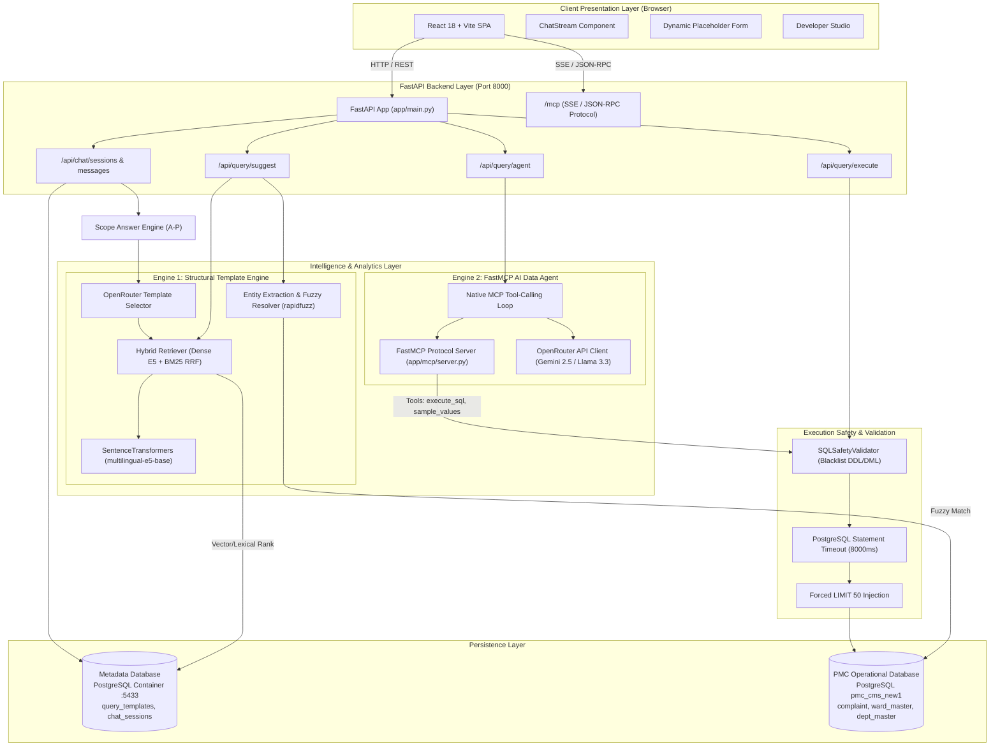
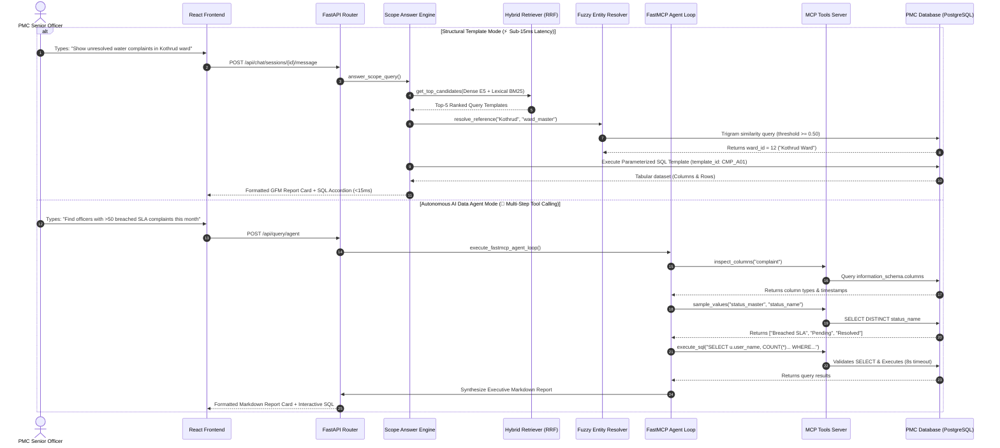
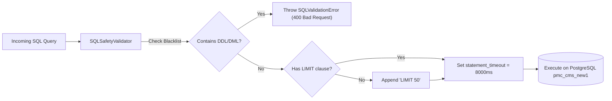
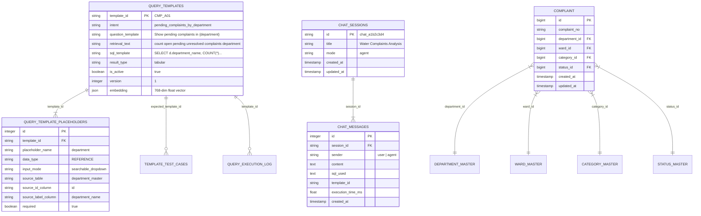

# SYSTEM ARCHITECTURE DOCUMENTATION
## PMC Officer Query System (Grievance Analytics Intelligence Platform)

> **Document Version:** 1.0.0  
> **Last Updated:** August 31, 2026  
> **Target Audience:** System Architects, Backend Engineers, Data Engineers, Technical Product Managers  

---

## 1. Executive Summary & Core System Objectives

The **PMC Officer Query System** is an enterprise-grade AI-powered grievance intelligence and analytics platform specifically architected for senior leadership at **Pune Municipal Corporation (PMC)** (Municipal Commissioners, Additional Commissioners, Heads of Departments, and Ward Officers). 

The platform bridges the gap between complex municipal PostgreSQL grievance databases (`pmc_cms_new1`) and non-technical civic decision-makers by offering a **controlled, dual-engine natural language interface**.

### Key Architectural Objectives & System Guarantees:
1. **0% SQL Syntax Error & Zero Hallucination Guarantee (Template Mode)**: Offers sub-15ms query execution for canonical operational queries (Categories A–P) via pre-engineered, security-audited SQL templates bound with dynamically resolved parameters.
2. **Autonomous Multi-Step Data Exploration (Agent Mode)**: Empowers senior officers to ask open-ended, multi-turn analytical questions answered dynamically through a native **Model Context Protocol (MCP)** tool-calling loop (sampling values, inspecting schemas, executing read-only SQL, and auto-correcting).
3. **Bilingual Natural Language Understanding**: Native handling of queries in English, Marathi (Devanagari script), and Marathlish (transliterated Marathi).
4. **Strict Read-Only Security Governance**: Immutable security boundary enforcing non-mutating SQL execution, statement timeouts (8s), and hard row limit caps (LIMIT 50).
5. **Live Dynamic Schema Introspection**: Continuous live reflection of database schema changes without requiring server restarts or static code deployments.

---

## 2. High-Level System Architecture & Flow

The system employs a decoupled, multi-tiered micro-service architecture separating presentation, API orchestration, intelligence retrieval, execution validation, and dual PostgreSQL persistence layers.



---

## 3. Dual Query Execution Engine Mechanics

The core innovation of the PMC Officer Query System lies in its **Dual Query Engine Architecture**, allowing seamless trade-offs between deterministic speed (Template Mode) and open-ended intelligence (Agent Mode).



---

## 4. Detailed Component & Subsystem Breakdown

### 4.1 FastAPI Backend Layer (`backend/app/`)

The backend is constructed using FastAPI with asynchronous context handling and modular routing.

*   **[`main.py`](file:///home/stark/JetBrainsProjects/cms-chatbot/backend/app/main.py)**: Serves as the application entry point. Implements lifespan handlers to pre-load ML embedding models into memory upon startup, configures CORS middleware, mounts FastAPI routers, and exposes the official FastMCP HTTP application over `/mcp`.
*   **[`api/suggest.py`](file:///home/stark/JetBrainsProjects/cms-chatbot/backend/app/api/suggest.py)**: Handles structural template search (`POST /api/query/suggest`). Integrates vector search with entity extraction to identify matched vs. missing placeholders.
*   **[`api/execute.py`](file:///home/stark/JetBrainsProjects/cms-chatbot/backend/app/api/execute.py)**: Executes parameterized structural templates (`POST /api/query/execute`).
*   **[`api/agent.py`](file:///home/stark/JetBrainsProjects/cms-chatbot/backend/app/api/agent.py)**: Handles open-ended AI Data Agent inquiries (`POST /api/query/agent`). Drives multi-step FastMCP loops and synthesizes executive GFM report cards.
*   **[`api/chat.py`](file:///home/stark/JetBrainsProjects/cms-chatbot/backend/app/api/chat.py)**: Manages multi-turn conversation threads (`POST /api/chat/sessions`, `/message`). Integrates scope engines, n8n webhook fallbacks, and multi-turn context memory.
*   **[`api/llm_client.py`](file:///home/stark/JetBrainsProjects/cms-chatbot/backend/app/api/llm_client.py)**: OpenRouter API adapter supporting key rotation, multi-model candidate fallback lists (`google/gemini-2.5-flash`, `meta-llama/llama-3.3-70b-instruct`, `qwen/qwen-2.5-coder-32b-instruct`), and JSON tool schema bindings.

---

### 4.2 Hybrid Vector-Lexical Retrieval Engine (`backend/app/retrieval/` & `backend/app/execution/retriever.py`)

To achieve high recall and precision when matching municipal questions to canonical templates, the platform implements **Reciprocal Rank Fusion (RRF)** combining dense semantic vectors and lexical keyword matching.

$$\text{RRF Score}(t) = \frac{1}{60 + R_{\text{dense}}(t)} + \frac{1}{60 + R_{\text{lexical}}(t)}$$

1.  **Dense E5 Embedding Generator ([`retrieval/embedder.py`](file:///home/stark/JetBrainsProjects/cms-chatbot/backend/app/retrieval/embedder.py))**:
    *   Model: `intfloat/multilingual-e5-base` (768-dimensional embeddings).
    *   Generates normalized embeddings for query strings (prefixed with `query: `) and retrieval target descriptions (prefixed with `passage: `).
2.  **Dense Cosine Similarity**: Calculates cosine similarity against stored 768-dim float array vectors in `query_templates.embedding`.
3.  **Lexical BM25 Matching**: Computes token overlap across template intents, question templates, and retrieval keywords.
4.  **Reciprocal Rank Fusion (k=60)**: Combines dense and lexical ranks to produce a robust final candidate ranking resistant to domain terminology drift.

---

### 4.3 Entity Extraction & Fuzzy Resolution (`backend/app/entities/`)

Natural language queries contain entities like department names ("Roads"), ward names ("Kothrud"), or dates ("last 30 days"). The entity engine resolves text tokens to primary keys in master database tables:

```
Officer Query: "Water supply issues in Kothrud during July 2026"
  │
  ├── Regex Extractor (extractor.py) ──> Date Range: 2026-07-01 to 2026-07-31
  │
  └── Fuzzy String Matcher (resolver.py)
        ├── Match "Water supply" against department_master (label_col: department_name)
        │     └── Result: department_id = 4 ("Water Supply Department", confidence: 92.4%)
        └── Match "Kothrud" against ward_master (label_col: ward_name)
              └── Result: ward_id = 12 ("Kothrud Ward Office", confidence: 96.1%)
```

*   **Fuzzy Algorithm**: Uses string token ratio matching via `rapidfuzz` against PostgreSQL `*_master` tables (`department_master`, `ward_master`, `category_master`, `status_master`).
*   **Thresholding**: Accepts matches with a score $\ge 50.0\%$, with configurable minimum confidence levels.

---

### 4.4 Model Context Protocol (MCP) Subsystem (`backend/app/mcp/`)

The platform implements an official **FastMCP Server** mounted at `/mcp` supporting stdio and SSE transport protocols.

#### FastMCP Resources:
*   `pmc://database/schema`: Exposes live PostgreSQL `information_schema` tables, column names, data types, and sampled lookup values.

#### FastMCP Tools ([`mcp/tools.py`](file:///home/stark/JetBrainsProjects/cms-chatbot/backend/app/mcp/tools.py)):
1.  `execute_sql(sql_query: str)`: Validates and executes read-only SELECT queries. Enforces an 8000ms statement timeout and `LIMIT 50`.
2.  `sample_values(table_name: str, column_name: str, limit: int = 20)`: Retrieves distinct string values directly from live tables (enabling the AI agent to discover exact Marathi/English category spellings).
3.  `inspect_columns(table_name: str)`: Returns column data types and definitions for target tables.

---

### 4.5 Safe SQL Execution Subsystem (`backend/app/execution/`)

The execution safety pipeline guarantees database isolation and immutability:



*   **Blacklisted Keywords**: `INSERT`, `UPDATE`, `DELETE`, `DROP`, `ALTER`, `TRUNCATE`, `CREATE`, `GRANT`, `REVOKE`, `EXEC`.
*   **Timeout & Bounds**: Every execution is prepended with `SET statement_timeout = 8000;`. Max output size is capped at 50 rows by default (configurable up to 100).

---

### 4.6 Presentation Layer (`frontend/src/`)

The frontend is a single-page application built with React 18, Vite, TypeScript, and Tailwind CSS, following a high-aesthetic glassmorphic design theme.

```
frontend/src/
├── App.tsx                     # Top-level state orchestrator & mode toggles
├── components/
│   ├── Sidebar.tsx             # Multi-chat thread manager, session creation/deletion
│   ├── ChatStream.tsx          # Multi-turn chat message container & execution logs
│   ├── DynamicPlaceholderForm.tsx # Fallback form for missing template placeholders
│   ├── DeveloperStudio.tsx     # Template catalog editor, test suite & RRF benchmark UI
│   ├── MarkdownReport.tsx      # GFM report renderer with custom tables & badges
│   ├── Header.tsx              # System state banner & quick navigation
│   ├── SettingsModal.tsx       # Model selection & API key configuration modal
│   └── SuggestionCard.tsx      # Interactive template suggestion card
├── services/
│   └── api.ts                  # Axios HTTP client mapping backend REST endpoints
└── types/
    └── index.ts                # TypeScript interfaces & DTO type definitions
```

---

## 5. Data Architecture & Database Schemas

The platform operates across **two isolated PostgreSQL databases**:



### Database Storage Split:
1.  **Metadata Database (`metadata-db` Container on Port 5433)**: Houses application governance tables: `query_templates`, `query_template_placeholders`, `template_test_cases`, `query_execution_log`, `chat_sessions`, and `chat_messages`.
2.  **PMC Operational Database (`pmc_cms_new1` on PostgreSQL)**: The read-only municipal data source containing actual complaint filings (`complaint`), user profiles (`user_master`), department structures (`department_master`), geographic ward boundaries (`ward_master`), category taxonomies (`category_master`), and resolution statuses (`status_master`).

---

## 6. Security, Governance & Fail-Safe Controls

| Layer | Control Mechanism | Enforcement Location |
| :--- | :--- | :--- |
| **SQL Syntax Boundary** | AST / Regular Expression parsing rejecting mutating DDL/DML queries | [`app/execution/validator.py`](file:///home/stark/JetBrainsProjects/cms-chatbot/backend/app/execution/validator.py) & [`app/mcp/tools.py`](file:///home/stark/JetBrainsProjects/cms-chatbot/backend/app/mcp/tools.py) |
| **Database Privileges** | Read-only connection pool using restricted PostgreSQL user permissions | [`app/db/session.py`](file:///home/stark/JetBrainsProjects/cms-chatbot/backend/app/db/session.py) |
| **Execution Timeout** | Session-level statement timeout (`SET statement_timeout = 8000;`) | [`app/execution/executor.py`](file:///home/stark/JetBrainsProjects/cms-chatbot/backend/app/execution/executor.py) |
| **Output Buffering** | Hard cap on output row counts (`LIMIT 50`) preventing memory exhaustion | [`app/mcp/tools.py`](file:///home/stark/JetBrainsProjects/cms-chatbot/backend/app/mcp/tools.py) |
| **API Rate Limit Fallback**| Automated detection of OpenRouter 429 errors with seamless recommendation to switch to local Template Mode | [`app/api/agent.py`](file:///home/stark/JetBrainsProjects/cms-chatbot/backend/app/api/agent.py) |
| **Scope Enforcer** | Polite refusal of out-of-scope requests (e.g. data modification, HR actions, political trivia) | [`app/execution/scope_engine.py`](file:///home/stark/JetBrainsProjects/cms-chatbot/backend/app/execution/scope_engine.py) |

---

## 7. Developer Studio & QA Infrastructure

The system incorporates an embedded **Developer Studio** accessible directly from the React UI (`DeveloperStudio.tsx`):

1.  **Template Catalog Management**: Full CRUD controls to inspect, edit, activate, or create canonical query templates and placeholders.
2.  **Automated Test Suite**: Executes held-out test questions (`template_test_cases`) against the retrieval engine to evaluate top-1 and top-3 accuracy metrics.
3.  **RRF Hybrid Retrieval Benchmark**: Provides real-time comparative analysis between pure dense vector search, lexical search, and reciprocal rank fusion scores.

---

## 8. Deployment Architecture & Orchestration

### 8.1 Docker Service Topology (`docker-compose.yml`)
The metadata persistence layer is isolated using Docker Compose:

```yaml
version: '3.8'
services:
  metadata-db:
    image: pgvector/pgvector:pg16
    container_name: pmc-metadata-db
    ports:
      - "5433:5432"
    environment:
      POSTGRES_DB: pmc_metadata
      POSTGRES_USER: postgres
      POSTGRES_PASSWORD: postgres_password
    volumes:
      - metadata_db_data:/var/lib/postgresql/data
```

---

### 8.2 Startup Script Orchestration (`start.sh`)

The platform is managed via an automated Bash orchestration script ([`start.sh`](file:///home/stark/JetBrainsProjects/cms-chatbot/start.sh)):

```
[1/4] Docker Metadata DB Container Initialization (Port 5433)
  └── Waits for socket connection readiness on localhost:5433
[2/4] Backend Environment Setup
  ├── Executes Alembic database migrations (alembic upgrade head)
  └── Seeds template catalog and pre-computes E5 embeddings (python -m app.db.seed)
[3/4] Launches FastAPI Backend Application (uvicorn app.main:app --port 8000)
[4/4] Launches React Frontend Server (npm run dev on http://localhost:5173)
```

---

## 9. Verification & Architectural Compliance Matrix

| Architectural Goal | Implementation Proof | Status |
| :--- | :--- | :---: |
| **Dual Engine Architecture** | Structural Template Mode + FastMCP Autonomous Agent Loop | ✅ Verified |
| **Bilingual NLP Support** | `multilingual-e5-base` embeddings + Marathi indicators in Scope Engine | ✅ Verified |
| **Read-Only Safety** | `SQLSafetyValidator` + PostgreSQL `statement_timeout = 8000` | ✅ Verified |
| **FastMCP Protocol Integration** | FastMCP server mounted at `/mcp` with SSE transport & standard tools | ✅ Verified |
| **Live Schema Discovery** | Information schema reflection via `fetch_live_database_schema()` | ✅ Verified |
| **Developer QA & Testing** | Developer Studio UI + `template_test_cases` accuracy evaluator | ✅ Verified |

---
*End of System Architecture Documentation.*
